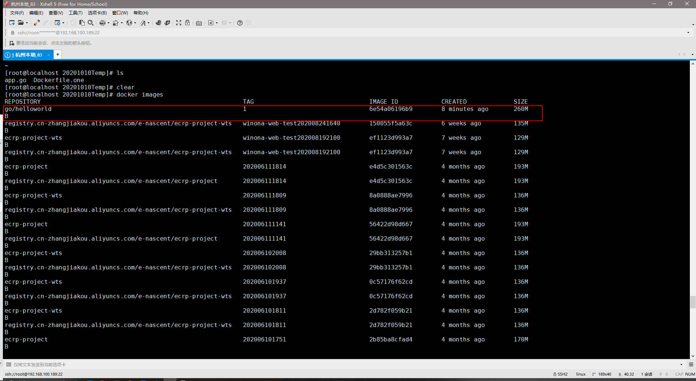
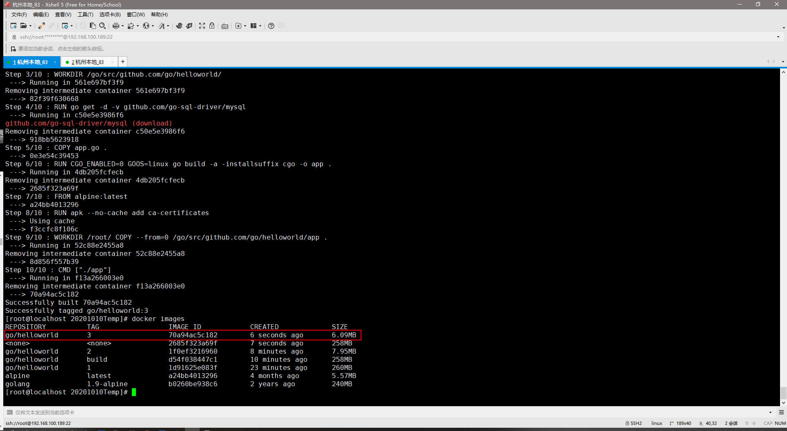

# Dockerfile之多阶段构建
## 该文档想表达什么?
使用多阶段构建镜像的方式来构建镜像，进而优化镜像体积，优化部署时间以及增强Dockerfile维护性
## 执行模式
多阶段构建镜像的方式的执行模式（分两步）： 
    1.   在某个地方将程序编译好
    2.   再将编译好的程序构建到镜像里面去,从而避免将依赖库也构建到镜像中去，也减少了镜像的层数
## 背景
使用Dockerfile构建镜像有以下几种方式，接下来将分别说明.
   1. 方式一：  全部放入一个Dockerfile中
   2. 方式二：  分散到多个Dockerfile中
   3. 方式三：  使用多阶段构建（全部放入一个Dockerfile中）
   
-------------------
## 方式一：全部放入一个Dockerfile中
+ 这种方式是将所有的构建过程编排到一个Dockerfile中，包括项目及其依赖库的编译、测试、打包等流程，这也可能带来一些问题：
    1. Dockerfile特别长，可维护性降低
    2. 镜像层次多，镜像体积较大，部署时间变长
    3. 源代码存在泄漏的风险
### 实践一下
#### 1. 编写app.go文件，该程序输出Hello World!!!
```go
package main

import "fmt"

func main(){
  fmt.Printf("Hello World!!!\n");
}
```
#### 2. 编写Dockerfile.one文件
```yaml
FROM golang:1.9-alpine

RUN apk --no-cache add git ca-certificates

WORKDIR /go/src/github.com/go/helloworld/

COPY app.go .

RUN go get -d -v github.com/go-sql-driver/mysql \
    && CGO_ENABLED=0 GOOS=linux go build -a -installsuffix cgo -o app . \
        && cp /go/src/github.com/go/helloworld/app /root
WORKDIR /root/
CMD ["./app"]
```
### 3. 构建镜像
+ docker build -t go/helloworld:1 -f Dockerfile.one .
#### 4. 查看镜像
+ 
+ 通过上述截图可以看出，该镜像大小为260MB
-----------------
## 方式二：分散到多个Dockerfile中
+ 事先在一个Dockerfile将项目及其依赖库变异测试打包好后，再将其拷贝到运行环境中，这种方式需要我们编写两个Dockerfile和一些编译脚本才能将其两个阶段自动整合起来，这种方式虽然可以很好的规避第一种方式存在的风险，但明显部署过程比较复杂。
### 实践一下
#### 1. 编写Dockerfile.build文件
```yml
FROM golang:1.9-alpine

RUN apk --no-cache add git

WORKDIR /go/src/github.com/go/helloworld

COPY app.go .

RUN go get -d -v github.com/go-sql-driver/mysql \
    && CGO_ENABLED=0 GOOS=linux go build -a -installsuffix cgo -o app .
```
#### 2. 编写Dockerfile.copy文件
```yaml
FROM alpine:latest

RUN apk --no-cache add ca-certificates

WORKDIR /root/

COPY app .

CMD ["./app"]
```
#### 3. 编写build.sh文件
```sh
#!/bin/sh 
echo Building go/helloworld:build 

docker build -t go/helloworld:build . -f Dockerfile.build

docker create --name extract go/helloworld:build
docker cp extract:/go/src/github.com/go/helloworld/app ./app
docker rm -f extract

echo Building go/helloworld:2 

docker build --no-cache -t go/helloworld:2 . -f Dockerfile.copy

rm ./app
```
+ 如上脚本，执行方式是：
     1. 使用Dockerfile.build来构建镜像，在构建镜像的时候，会将app.go文件进行编译，获得二进制可执行文件:app
     2. 使用第一步构建的镜像来创建容器，将二进制可执行文件app拷贝到物理机上
     3. 使用Dockerfile.copy来构建进行，在构建镜像的过程中，将第二步拷贝出来的二进制可执行文件app拷贝到新的进行中去。
     4. 使用这种方式，将依赖库与镜像分开，减小镜像的体积
#### 4. 运行脚本，构建镜像
+ chmod a+x build.sh
+ ./build.sh
#### 5. 查看镜像
+ 
+ 如上，使用方式二构建的镜像大小为7.95MB

----------------------
## 方式三：使用多阶段构建
+ 为了解决方式一和方式二构建方式的问题，现引进了多阶段构建方式来构建镜像。

### 实践一下
#### 1. 编写Dockerfile.mo文件
```yaml
FROM golang:1.9-alpine 

RUN apk --no-cache add git 

WORKDIR /go/src/github.com/go/helloworld/ 

RUN go get -d -v github.com/go-sql-driver/mysql 

COPY app.go . 

RUN CGO_ENABLED=0 GOOS=linux go build -a -installsuffix cgo -o app . 

FROM alpine:latest 

RUN apk --no-cache add ca-certificates 

WORKDIR /root/ 

COPY --from=0 /go/src/github.com/go/helloworld/app . 

CMD ["./app"]
```
#### 2. 构建镜像
+ docker build -t go/helloworld:3 -f Dockerfile . 
#### 3. 查看镜像
+ 
+ 如上图，使用该中方式构建的镜像大小为:6.09MB
#### 4. 命令讲解
+ 多阶段构建是Docker自带的功能，使用者可以使用Dockerfile命令的方式来实现。以下将讲解实现多阶段构建的命令。
##### 4.1 Dockerfile命令之FROM
1.  FROM文档地址:[点击进入](https://docs.docker.com/engine/reference/builder/#from)
2.  命令格式:
     -  FROM [--platform=<platform>] <image> [AS <name>]   或者
     -  FROM [--platform=<platform>] <image>[:<tag>] [AS <name>]  或者
     -  FROM [--platform=<platform>] <image>[@<digest>] [AS <name>]
3. 命令描述
    - From指令**初始化一个新的构建阶段**并且**为后续指令提供设置基础镜像**。一个有效的Dockerfile文件必须以FROM指令开始，这个镜像可以是任何有效的镜像--从公共存储库中提取映像开始特别容易。
         + ARG是在Dockerfile文件中唯一一个可以出现在From指令之前的指令 .
         + FROM可以在单个Dockerfile中出现多次，以创建多个映像或使用一个构建阶段作为另一个构建阶段的依赖项。只需在每条新的FROM指令之前记录commit输出的最后一个映像ID。每个FROM指令清除前面指令创建的任何状态。
         + 在FROM指令后面添加 AS name选项时，可以将name给到一个新的构建阶段。这个name可以在后续的FROM 和 COPY --from=<name>指令中去引用这个构建阶段的镜像。
         + 标签或摘要值是可选的。如果您省略其中任何一个，构建器默认会假定最新标记。如果生成器无法找到标记值，则返回一个错误。
   -  --platform选项标识可以用于指定镜像的平台，以防引用多平台镜像。例如linux/amd64, linux/arm64, or windows/amd64。默认情况下，使用构建请求的目标平台。可以在这个标识的值中使用全局构建参数，例如自动平台参数允许您强制一个阶段为本地构建平台(--platform=$BUILDPLATFORM),并使用它在构建阶段中交叉编译到目标平台。
###### 4.2 Dockerfile命令之COPY
1. COPY文档地址：[点击进入](https://docs.docker.com/engine/reference/builder/#copy)
2. 命令格式:
     - COPY [--chown=<user>:<group>] <src>... <dest>
     - COPY [--chown=<user>:<group>] ["<src>",... "<dest>"]
3. 命令描述：
    - COPY命令接受 --from=name|index (index从0开始)参数，可以将源位置设置为之前的构建阶段(由FROM .. AS <name>创建)，用于代替用户发送的构建上下文。如果无法找到具有指定名称的构建阶段，那么就使用具有相同名称的镜像。那么就可以使用这种方式将上一个构建阶段里面的文件拷贝到这个构建阶段上.
       + 如命令: COPY --from=0 /go/src/github.com/go/helloworld/app .