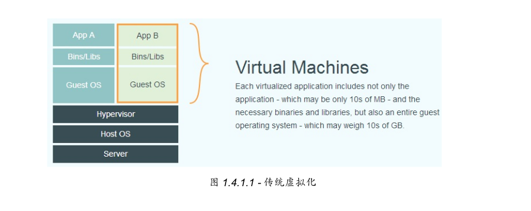
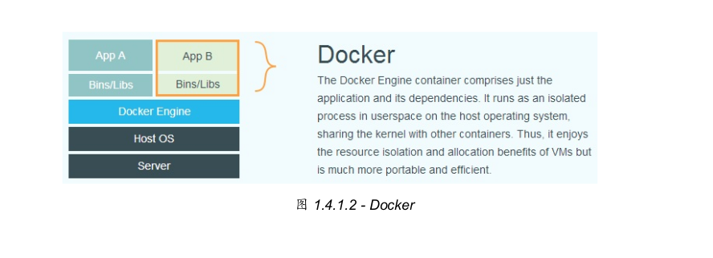
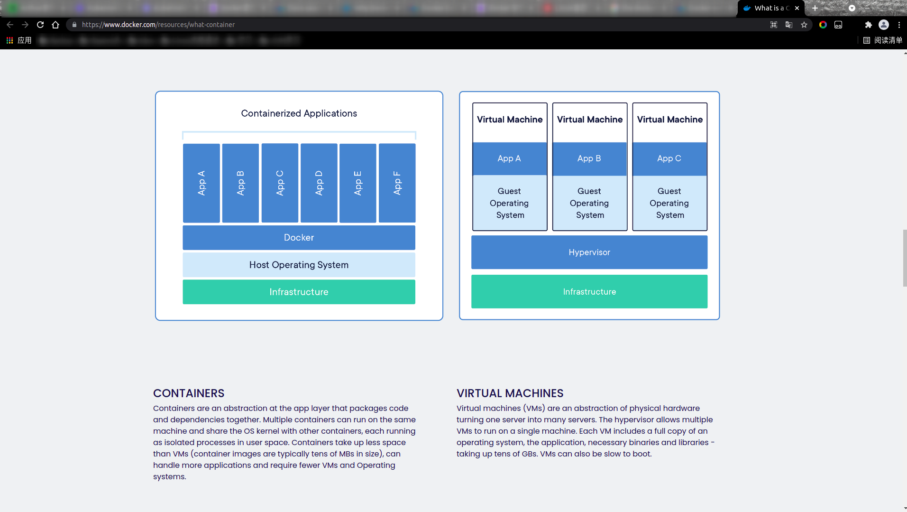
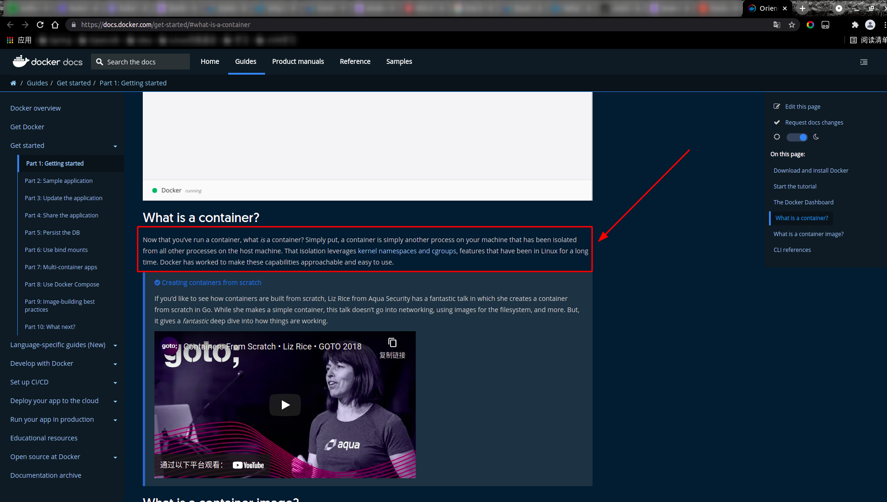

# K8S(Kubernetes)是什么
&nbsp;&nbsp;Kubernetes 是一个可移植的、可扩展的开源平台，用于管理容器化的工作负载和服务，可促进声明式配置和自动化。 Kubernetes 拥有一个庞大且快速增长的生态系统。Kubernetes 的服务、支持和工具广泛可用。

&nbsp;&nbsp;Kubernetes 这个名字源于希腊语，意为“舵手”或“飞行员”。k8s 这个缩写是因为 k 和 s 之间有八个字符的关系。 Google 在 2014 年开源了 Kubernetes 项目。Kubernetes 建立在 Google 在大规模运行生产工作负载方面拥有十几年的经验 的基础上，结合了社区中最好的想法和实践。

## 部署方式的进化
&nbsp;&nbsp;如下图，可以看到应用部署方式的变化:
- 

&nbsp;&nbsp;从图中可以看出，部署方式由传统部署 -> 虚拟化部署 -> 容器化部署
### 传统部署
&nbsp;&nbsp;早期，各个组织机构在物理服务器上运行应用程序。无法为物理服务器中的应用程序定义资源边界，这会导致资源分配问题。 例如，如果在物理服务器上运行多个应用程序，则可能会出现一个应用程序占用大部分资源的情况， 结果可能导致其他应用程序的性能下降。 一种解决方案是在不同的物理服务器上运行每个应用程序，但是由于资源利用不足而无法扩展， 并且维护许多物理服务器的成本很高。

### 虚拟化部署
&nbsp;&nbsp;作为解决方案，引入了虚拟化。虚拟化技术允许你在单个物理服务器的 CPU 上运行多个虚拟机（VM）。 虚拟化允许应用程序在 VM 之间隔离，并提供一定程度的安全，因为一个应用程序的信息 不能被另一应用程序随意访问。
&nbsp;&nbsp;虚拟化技术能够更好地利用物理服务器上的资源，并且因为可轻松地添加或更新应用程序 而可以实现更好的可伸缩性，降低硬件成本等等。
&nbsp;&nbsp;每个 VM 是一台完整的计算机，在虚拟化硬件之上运行所有组件，包括其自己的操作系统。
#### 虚拟化部署示意图
- 

### 容器化部署
&nbsp;&nbsp;容器类似于 VM，但是它们具有被放宽的隔离属性，可以在应用程序之间共享操作系统（OS）。 因此，容器被认为是轻量级的。容器与 VM 类似，具有自己的文件系统、CPU、内存、进程空间等。 由于它们与基础架构分离，因此可以跨云和 OS 发行版本进行移植。

&nbsp;&nbsp;容器因具有许多优势而变得流行起来。下面列出的是容器的一些好处：
1. 敏捷应用程序的创建和部署：与使用 VM 镜像相比，提高了容器镜像创建的简便性和效率。
2. 持续开发、集成和部署：通过快速简单的回滚（由于镜像不可变性），支持可靠且频繁的 容器镜像构建和部署。
3. 关注开发与运维的分离：在构建/发布时而不是在部署时创建应用程序容器镜像， 从而将应用程序与基础架构分离。
4. 可观察性不仅可以显示操作系统级别的信息和指标，还可以显示应用程序的运行状况和其他指标信号。
5. 跨开发、测试和生产的环境一致性：在便携式计算机上与在云中相同地运行。
6. 跨云和操作系统发行版本的可移植性：可在 Ubuntu、RHEL、CoreOS、本地、 Google Kubernetes Engine 和其他任何地方运行。
7. 以应用程序为中心的管理：提高抽象级别，从在虚拟硬件上运行 OS 到使用逻辑资源在 OS 上运行应用程序。
8. 松散耦合、分布式、弹性、解放的微服务：应用程序被分解成较小的独立部分， 并且可以动态部署和管理 - 而不是在一台大型单机上整体运行。
9. 资源隔离：可预测的应用程序性能。
10. 资源利用：高效率和高密度。

&nbsp;&nbsp;对于容器化部署方式，图中的Container Runtime一般由Docker提供支持（Docker相关文档，详见001.Docker），使用Docker 作为容器运行时环境。因此，容器化部署的图可以理解为如下图所示:
- 

## K8S能带来什么
&nbsp;&nbsp;Kubernetes 为你提供了一个可弹性运行分布式系统的框架。 Kubernetes 会满足你的扩展要求、故障转移、部署模式等.

&nbsp;&nbsp;K8S能够提供:
1. 服务发现和负载均衡
   - Kubernetes 可以使用 DNS 名称或自己的 IP 地址公开容器，如果进入容器的流量很大， Kubernetes 可以负载均衡并分配网络流量，从而使部署稳定。
2. 存储编排
   - Kubernetes 允许你自动挂载你选择的存储系统，例如本地存储、公共云提供商等。
3. 自动部署和回滚
   - 你可以使用 Kubernetes 描述已部署容器的所需状态，它可以以受控的速率将实际状态 更改为期望状态。例如，你可以自动化 Kubernetes 来为你的部署创建新容器， 删除现有容器并将它们的所有资源用于新容器。
4. 自动完成装箱计算
   - Kubernetes 允许你指定每个容器所需 CPU 和内存（RAM）。 当容器指定了资源请求时，Kubernetes 可以做出更好的决策来管理容器的资源。
5. 自我修复
   - Kubernetes 重新启动失败的容器、替换容器、杀死不响应用户定义的 运行状况检查的容器，并且在准备好服务之前不将其通告给客户端。
6. 密钥与配置管理
   - Kubernetes 允许你存储和管理敏感信息，例如密码、OAuth 令牌和 ssh 密钥。 你可以在不重建容器镜像的情况下部署和更新密钥和应用程序配置，也无需在堆栈配置中暴露密钥。

--------
## 附录
### 001. Docker是什么(虚拟化应用和容器化应用比较)
+ 参考(官方)文档1:[https://www.docker.com/resources/what-container](https://www.docker.com/resources/what-container) 
   - 

      + CONTAINERS: Containers are an abstraction at the app layer that packages code and dependencies together. Multiple containers can run on the same machine and share the OS kernel with other containers, each running as isolated processes in user space. Containers take up less space than VMs (container images are typically tens of MBs in size), can handle more applications and require fewer VMs and Operating systems.

      + VIRTUAL MACHINES: Virtual machines (VMs) are an abstraction of physical hardware turning one server into many servers. The hypervisor allows multiple VMs to run on a single machine. Each VM includes a full copy of an operating system, the application, necessary binaries and libraries - taking up tens of GBs. VMs can also be slow to boot.
      + 通过图中的描述可以看出容器化部署方式与虚拟化部署方式的区别
+ 官方文档定义2: [https://docs.docker.com/get-started/#what-is-a-container](https://docs.docker.com/get-started/#what-is-a-container)
    - 
    
      + Now that you’ve run a container, what is a container? Simply put, a container is simply another process on your machine that has been isolated from all other processes on the host machine. That isolation leverages kernel namespaces and cgroups, features that have been in Linux for a long time. Docker has worked to make these capabilities approachable and easy to use.
-------
## 参考资料
1. K8S官方文档:[https://kubernetes.io/zh/docs/concepts/overview/what-is-kubernetes/](https://kubernetes.io/zh/docs/concepts/overview/what-is-kubernetes/)
2. Docker官方文档:[https://www.docker.com/resources/what-container](https://www.docker.com/resources/what-container)
3. 《Docker-从入门到实践》