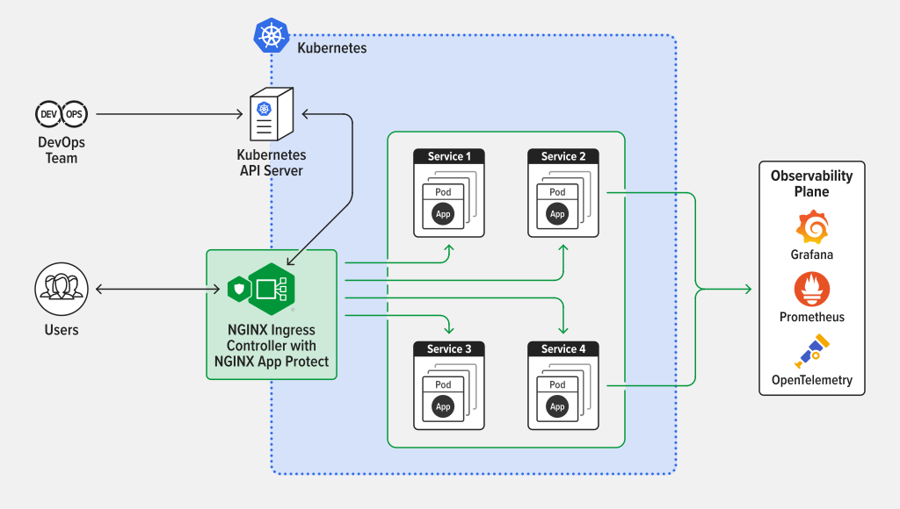

13.Kubernetes网络模型之Nginx-Ingress-Controller

Kubernetes网络模型之Nginx-Ingress-Controller
=======================================

总结
--

1.  Ingress Controller负责监听节点端口，接受请求，并且将根据Ingress的配置，将请求分发到不同的Service上.
2.  What is Ingress?
    - Ingress exposes HTTP and HTTPS routes from outside the cluster to services within the cluster.  Traffic routing is controlled by rules defined on the Ingress resource.(入口将来自集群外部的HTTP和HTTPS路由公开给集群内的服务。流量路由由Ingress资源上定义的规则控制。)
3. 在 Kubernetes (k8s) 中，Ingress 本身并不直接提供负载均衡功能，而是依赖 Ingress Controller 和底层负载均衡机制（如云厂商的 LB、Nginx、HAProxy 等）来实现流量分发. Ingress Controller 的负载均衡: Ingress Controller 会根据 Ingress 规则，将流量分发到后端 Service 的多个 Pod。具体实现方式：
   + 基于 Nginx Ingress Controller：
      - Nginx 作为反向代理，动态生成 nginx.conf 配置文件。
      - 默认使用 轮询（Round Robin） 算法分发请求到后端 Pod。
      - 支持其他算法（如最少连接、IP Hash 等），通过 nginx.ingress.kubernetes.io/load-balance 注解配置。
   + 其他云厂商提供,如 AWS ALB、GCE Ingress

Nginx-Ingress-Controller
------------------------

Ingress是kubernetes的一种API现象，将集群内部的Service通过HTTP/HTTPS方式暴露到集群外部，并通过规则定义HTTP/HTTPS的路由。Ingress具备如下的特性:集群外部可访问的URL，负载均衡，SSL Termination，按域名路由(name-based virtual hosting)  
Ingress Controller（通常需要负载均衡器配合）负责Ingress API对象所声明的能力  
如下图:

*   
    1.  Ingress Controller 监听所有worker节点上的80/443端口
    2.  Ingress Controller 将所有对域名a.kuboard.cn的HTTP/HTTPS请求路由到ServiceB的9080端口
    3.  Service B将请求进一步转发到其标签所选择的容器组中（通过targetPort来指定容器组上的端口号）

上图的数据包转发过程为:  
1\. 假设已经将a.kuboard.cn的DNS解析到了集群中的一个Worker节点的IP192.168.2.69.  
2\. 从客户机执行命令curl http://a.kuboard.cn/abc/，该请求将被转发到192.168.2.69这个地址的80端口，并被Ingress Controller接收。  
3\. Ingress Controller根据请求的域名a.kuboard.cn和路径abc匹配集群中所有的Ingress信息，并最终找到Ingress B中有这个配置，其对应的Service就是Service B的9080端口  
4\. Ingress Controller通过kube-proxy将请求转发到Servcie B对应的任意一个Pod上与Service B的9080端口对应的容器端口上(从Ingress Controller到Pod的负载均衡由kube-proxy+Service实现)

*   **即到这里，Ingress Controller已经请HTTP请求转发到Service B上了，接下来，是进行Service-To-Pod这一段了.**

### Ingress注意事项

*   Ingress只是Kuberneters中的一种配置信息；
*   Ingress Controller才是监听80/443端口，并根据Ingress上配置的路由信息执行HTTP路由转发的组件.
*   Ingress Controller并不是只能监听80/443端口，可以根据自己的网络拓扑的需要，选择合适的端口
*   **根据安装Ingress Controller的方式不同，Ingress Controller并不一定监听了所有worker节点的80/443端口**
*   也可以在集群中安装多种Ingress Controller

### Ingress Controller的类型

#### 1. [Nginx Ingress Controller For Kubernetes](https://www.nginx.com/products/nginx/kubernetes-ingress-controller)

*   Nginx Ingress Controller工作流程，如下图
    *   
    *   
    *   Deployed at the central point of entry into a Kubernetes cluster, NGINX Ingress Controller reduces complexity, increases uptime, and provides better insights into app health and performance at scale.(部署在Kubernetes集群的中心入口点，NGINX Ingress Controller降低了复杂性，增加了正常运行时间，并提供了更好的大规模应用健康和性能洞察。)

###### 1.01配置文件配置

    apiVersion: networking.k8s.io/v1beta1
    kind: Ingress
    metadata:
      name: my-ingress-for-nginx  # Ingress 的名字，仅用于标识
    spec:
      rules:                      # Ingress 中定义 L7 路由规则
      - host: a.demo.kuboard.cn   # 根据 virtual hostname 进行路由（请使用您自己的域名）
        http:
          paths:                  # 按路径进行路由
          - path: /
            backend:
              serviceName: nginx-service  # 服务的名称
              servicePort: 80  #服务的端口,即 当访问a.demo.kuboard.cn的时候，会转发到serviceName:ServicePort

## 参考资料
1. [Ingress](https://kubernetes.io/docs/concepts/services-networking/ingress/)
2. [Nginx-Ingress-Controller](https://docs.nginx.com/nginx-ingress-controller/)
3. [Nginx-Ingress-Controller(F5)](https://www.f5.com.cn/products/nginx/nginx-ingress-controller)
4. [kubernetes-ingress](https://github.com/nginx/kubernetes-ingress)
