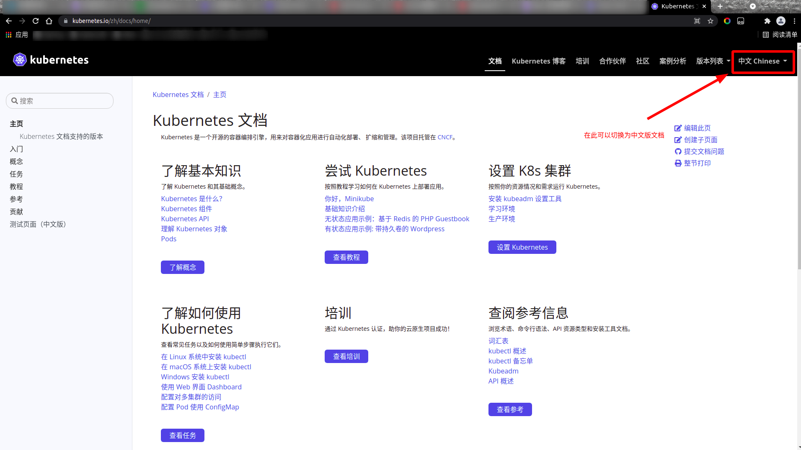
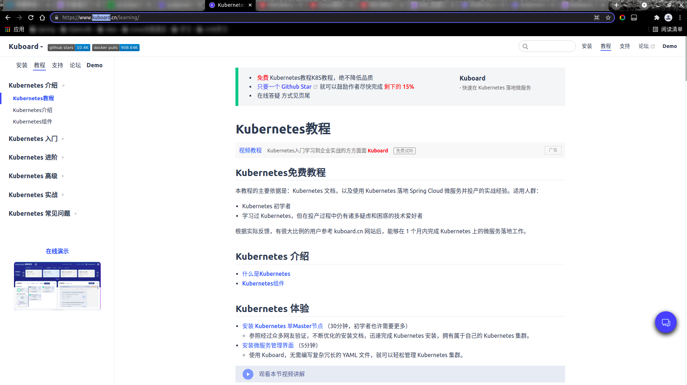

# K8S学习
&nbsp;&nbsp;官方文档已经较为详细了，因此可以直接参考官方文档.也有kuboard文档，便于你更好的理解

----------------------

## 官方文档(最好的文档)
&nbsp;&nbsp;K8S提供了多语言版本的官方文档，其中就有中文版本的文档。点击如下链接就可以直接查看到中文版的官方文档了: 
1. [官方文档][https://kubernetes.io/zh/docs/home/](https://kubernetes.io/zh/docs/home/).如下图:
  - 

2. [Kuboard文档][https://www.kuboard.cn/learning/](https://www.kuboard.cn/learning/),该文档有更多的示例图，方便更好的理解
  - 